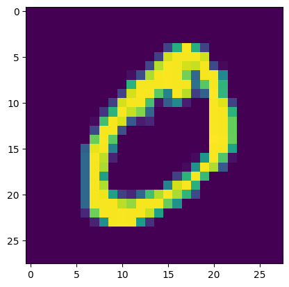
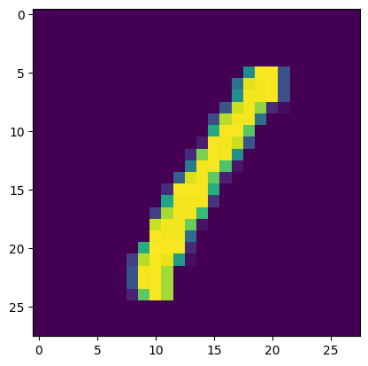
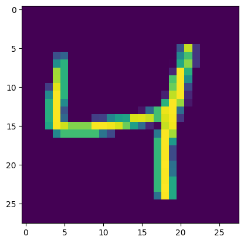
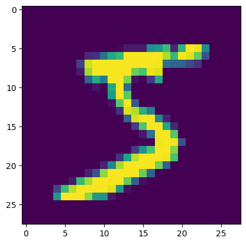
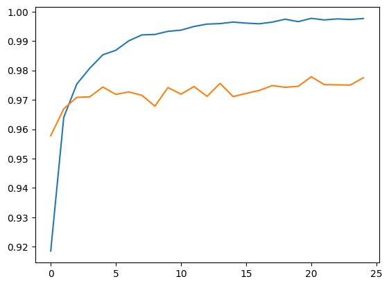
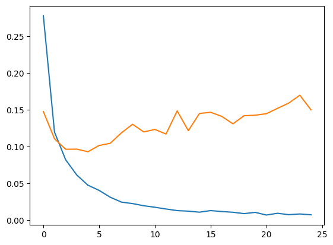

# MNIST CLassification ANN

## Overview

This project demonstrates how an **Artificial Neural Network (ANN)** can be used to classify handwritten digits from the MNIST dataset (0–9). The MNIST dataset contains 60,000 training images and 10,000 test images of 28x28 grayscale handwritten digits.

The main goal of this project is to build, train, and evaluate a neural network model capable of recognizing digits with high accuracy using **TensorFlow** and **Keras**.

This project serves as a beginner-friendly introduction to deep learning and neural network fundamentals.

#### Sample Images

<table>
  <tr>
    <td></td>
    <td></td>
    <td></td>
    <td></td>
  </tr>
</table>


## Objective

- Load and preprocess the MNIST dataset.
- Design a simple feedforward ANN architecture.
- Train the model using backpropagation and gradient descent.
- Evaluate its performance on the test dataset.
- Visualize predictions and accuracy metrics.

## Directory Structure

```md
Directory structure:
└── saumyajeet-varma-mnist-classification-ann/
    ├── images
    |   ├── 0.png
    |   ├── 1.png
    |   ├── 4.png
    |   └── 5.png
    ├── README.md
    ├── MNIST-NN.ipynb
    └── requirements.txt

```

## Workflow

#### Data Loading:
- Import the MNIST dataset directly from TensorFlow’s datasets module.

#### Data Preprocessing:
- Normalize pixel values from 0–255 to 0–1.
- Flatten 28x28 images into 784-dimensional vectors.

#### Model Architecture:
- **Input Layer**: 784 neurons (one for each pixel).
- **Hidden Layers 1**: 128 neurons dense layers with ReLU activation.
- **Hidden Layers 2**: 32 neurons dense layers with ReLU activation.
- **Output Layer**: 10 neurons with softmax activation (for digits 0–9).

#### Model Compilation:
- **Optimizer**: Adam
- **Loss Function**: Categorical Crossentropy
- **Metric**: Accuracy

#### Training:
- Train the model on the training dataset for a fixed number of epochs.

#### Evaluation:
- Test accuracy and loss on the validation dataset.

#### Visualization:
- Display accuracy and loss curves.

## Results

**Model Accuracy**: 98.06%

<table>
  <tr>
    <th>Accuracy</th>
    <th>Loss</th>
  </tr>
  <tr>
    <td></td>
    <td></td>
  </tr>
</table>

## Contributor

- [Saumyajeet Varma](https://github.com/Saumyajeet-Varma)